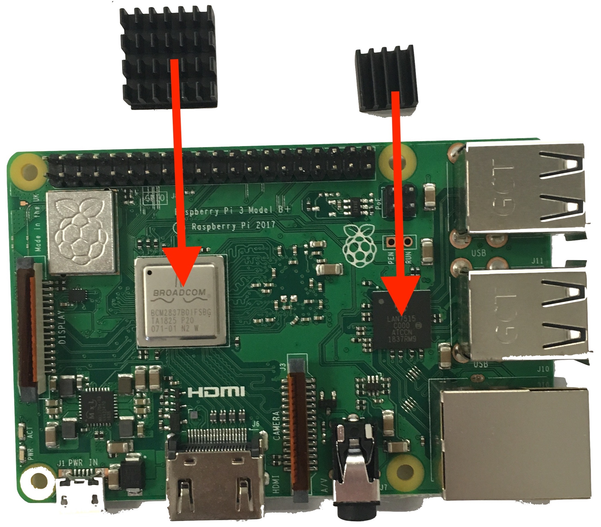
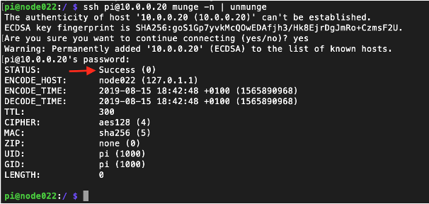

# How to Build a Low-Cost HPC Cluster

> This guide is the result of an independent study performed by [Nathan H. Silverman](https://www.linkedin.com/in/nathan-silverman-b35767173/), a  [Kalamazoo College](https://www.kzoo.edu)'s student in Computer Science, under the supervision of Sandino Vargas-Pérez. 
>
> The guide presents the list of components needed to create a low-cost Bewolf-type cluster, helpful pictures, instructions for assembling hardware, software installation, commands to execute proper configuration, and more.
>
> For questions, please contact Dr. Vargas-Pérez via [e-mail](mailto:sandino.vargasperez@kzoo.edu).

The guide was designed to build a cluster using 4 Raspberry Pi (RPi) computers, but it can be used to build a cluster of any size. The step-by-step instructions will detail how to assemble hardware, configure software, and the setup needed to have a fully functioning RPi cluster. The **Raspberry Pi 3 B+** model was used for this project, although with a few tweaks, any modern RPi should work.

# Hardware Setup and Assembly

Below are instructions to assemble a 4 RPi cluster. One RPi will be used as a head node, and the rest will be designated as worker nodes. The following diagram shows the layout for the cluster and its components: <br><br>

### Materials Required:
*The materials needed might change depending on their availability.*

- 4 Raspberry Pi (RPi) computers
- 4 MicroSD cards (32 or 64 GB w/adapter)
- 5 Ethernet cable (cat 5e or 6, 1 foot in length or more)
- 4 Micro USB Cords
- 1 Ethernet switch (with 5 ports or more)
- 1 USB power adapter (with 5 ports or more, 2.4 amps per port)
- 1 Stackable acrylic case for RPis
	- Make sure this item includes 4 layers, heatsinks, and it is compatible with the RPi model chosen <a href="https://www.amazon.com/dp/B07BGYGLZG/?coliid=I3A352BNN34AM2&colid=GT5EJQ2GW4AP&psc=1" target="_blank">&#10697;</a>. 
- Recommended tools:
	- Tweezers (Optional)
	- Screw driver
	- Monitor (or Ethernet to USB adapter to connect via VNC)

## Hardware Assembly

1. Installing Heat Sink: The stackable acrylic case included heat sinks. Install three heat sinks per RPi; two larger ones and a smaller one. The two larger heat sinks go on the Broadcom CPU and the RAM chip, the smaller one goes on the Ethernet and USB controller. Install heat sinks by removing the filament on the bottom and pushing firmly until they are attached securely. For all RPis: 
	1. Install a large heat sink on Broadcom CPU and a small heat sink on the Ethernet and USB controller, both located on top of the RPi:<br>
	1. Install a large heat sink on the ram chip located on the bottom of the RPi:<br>

1. Place the RPi on acrylic plate. For all RPis:
	1. Review any included instructions for the case. 
	1. Remove protective films from each side of the plate. (This can be difficult; use a screwdriver or tweezers).
	1. Place screws in the plate such that the screw heads are against the plate and the threads are pointing up, making sure that it is the correct orientation. The square cutout in the plate should line up with the heatsink on the bottom of the RPi.
	1. Put spacers on the screws on top of the plate: **screw -> plate -> spacer**.
	1. Place RPi through the screws such that the heat sink on the bottom fits through the square cutout: **screw &rarr;  plate &rarr;  spacer &rarr; Pi**. 
	1. Place and tighten nuts on the screws on top of the RPi, making sure to tighten them: **screw &rarr; plate &rarr; spacer &rarr; RPi &rarr; nut**. 

1. Stack RPis to form a tower:
	1. Put the screw end of the nub through the plate into the open end of the leg to keep it in place. Repeat for all four of the first layers: **nub &rarr; plate &rarr; leg**
	1. Place the next plate on top of the screw end of the leg: **leg &rarr; plate &rarr; leg**
	1. Place the final plate on legs then and secure it with the silver nut on top: **leg &rarr; plate w/o Pi &rarr; silver nut**

# Software Installation and Setup

The next sections will walk through setting up the microSD cards for the cluster. These examples were using macOS, but all the software needed can be downloaded for Windows OS.

### Software Download Requirements:
- Latest version of **Raspberry Pi OS with desktop** for head node and **Raspberry Pi OS Lite** for worker node <a href="https://www.raspberrypi.com/software/operating-systems/" target="_blank">&#10697; link</a>.
- **Raspberry Pi Imager** to install (flash) Raspberry Pi OS images into the microSD card <a href="https://www.raspberrypi.com/software/" target="_blank">&#10697; link</a>.
- **VNC Viewer** to connect to the head node using an external computer (optional, but recommended) <a href="https://www.realvnc.com/en/connect/download/viewer/" target="_blank">&#10697; link</a>.


## Setting Up MicroSD Cards 

1. Formatting MicroSD Card:
	1. Plug microSD card into a computer. *Use a USB to microSD adapter if the computer doesn't have microSD or SD card slots*.
	1. On macOS: open **Disk Utility** and navigate to the microSD card. Select **Erase** in the top center of the window. In the "Format" dropdown menu, select "MS-DOS (FAT)". Click **Erase** (the name of the device does not matter).
	1. On Windows: use **Windows Explorer** to locate the microSD card, right-click on it, and select **Format**. Select **Quick Format** and click start.
1. Open Raspberry Pi Imager to flash the microSD card:
	1. Click **CHOOSE OS** and select the last option **Use custom**. Navigate to where the Raspberry Pi OS was downloaded. The files should end in `.img` or `.img.xz`. Select **Raspberry Pi OS with desktop** if flashing the head node's microSD card, or  **Raspberry Pi OS Lite** if flashing the worker nodes' card.
	1. Click **CHOOSE STORAGE** and chose the microSD card.
	1. Click the gear symbol to open the **Advanced options**. 
		1. Check **Set hostname** and use the default hostname `raspberrypi.local`.
		1. Check **Enable SSH** and then check **Use password authentication**.
		1. Check **Set Username and pasword** and use `pi` as the **Username** and `raspberry` as the **Password**.
		1. Click **Save**
	1. Click **WRITE** <br>
1. Remove the flashed microSD card from the computer. *Must of the time Raspberry Pi Imager will automatically eject SD cards when finished*

## Configuring RPis

Next are instructions to logging into the RPis and edit some configuration files to make them work as a cluster. Accessing the RPis can be done with or without an external monitor. Follow **1. Access RPi with external monitor** if using an external monitor, or **2. Access RPi without external monitor** otherwise (most common way). As a side note, you should perform **3. Configuring Hostnames** and **4. RPi's OS Configuration** in sequence while connected to the RPis, to avoid having to connect and disconnect each time.

1. **Access RPi with external monitor**:
	1. Insert the microSD card into the RPi. 
	1. Connect RPi to Internet using an Ethernet cable (if the RPi comes with WiFi, this is optional).
	1. Connect external monitor through HDMI.
	1. Connect the RPi to the USB power adapter using one of the micro USB cables, and then turn the RPi on. A boot up screen should show up in the external monitor.
	1. Once booted up, some versions of **Raspberry Pi OS** will have a prompt to change password, set time zone, and update the OS. Follow these instructions, or do it manually later.

    If the RPi has started but the external monitor is not getting a signal, unplug RPi and remove its microSD card. Insert the card into a computer and navigate to its contents. Locate and open the file `config.txt`. If the following lines are commented out, uncomment them by removing the `#` in front of them (if they don't exist, add them): 
    ```
    hdmi_safe=1 
    ```
    This setting will be used to try to boot the RPi with maximum HDMI compatibility. Re-insert the microSD in the RPi and turn it on. If the previous modifications didn't fix the problem, check that the monitor is connected properly to the correct input, and the HDMI cable is functional.

1. **Access RPi without external monitor** (most common way): This step will require an Ethernet to USB adapter to connect the RPi via Ethernet cable to a computer using **VNC viewer**. If the computer has an Ethernet port, the adapter is not needed.
	1. Start with the RPi designated as head node, and then repeat these steps with the rest of the RPis . Insert the microSD card into the RPi (this is the card with **Raspberry Pi OS with desktop** in it). 
	1. Connect the RPi to a computer using an Ethernet cable. Use an Ethernet to USB adapter if the computer doesn't have an Ethernet port. You might also power up the RPi by connecting the micro USB power cable to one of the computer's USB ports, or into the USB power adapter.<br>
	1. Be sure to turn on "Internet Sharing". 
		- On macOS: Select **System Preferences &rarr; Sharing**, and make sure "Internet Sharing" is checked and the WiFi connection is being shared with the ethernet LAN connection.
		- On Windows: <a href="https://www.tomshardware.com/how-to/share-internet-connection-windows-ethernet-wi-fi" target="_blank">&#10697; link Windows 10</a>. 
	1. Open the **Terminal** and run the command `ping raspberrypi.local`. Alternatively, you can type the command `arp -a` and copy the IP address associated with `raspberrypi.local`
	1. Copy the IP address that is associated to the RPi. Press <kbd>ctrl</kbd> + <kbd>z</kbd>  (<kbd>^</kbd> + <kbd>z</kbd> on macOS).<br>
	1. Then type the command `ssh pi@192.168.2.8`, where `192.168.2.8` is the IP address you copied in the previous step.
	1. Type `Yes` and press <kbd>enter</kbd> (<kbd>return</kbd> in macOS).
	1. Enter the RPi **username** and **password**. By default the username is `pi` and the password is `raspberry`. 
		- *If working with an RPi designated as a worker node, skip next steps and proceed to:* **3. Configuring Hostnames**
	1. Head node only: Start the VNC virtual desktop in the RPi by opening a terminal and typing `vncserver`
	1. Copy the IP of the RPi: <br>
	1. Open the **VNC Viewer** application installed in the computer and paste the IP in the top search bar. It should prompt you for the RPi **username** and **password**. Remember by default it should be username: `pi`, password: `raspberry`.

1. **Configuring Hostnames**: Choose a host name for your RPis carefully. Later, a scheduler called Slurm will be used to manage workload and running code in the cluster. Slurm requires nodes to be named a certain way, such as `node001` for the head node, and `node002`, `node003`, and `node004` for the worker node. 
	1. Open a **Terminal** in the RPi and type the following commands to change the host name:
		- `sudo hostname headnode001`, where `headnode001` is the host name you chose for the RPi.
		- `sudo nano /etc/hostname`, this will open the file `/etc/hostname` using the text editor **nano**. Delete everything, and enter the same host name, i.e., `headnode001` or the host name chosen for the RPi. To save press <kbd>ctrl</kbd> + <kbd>x</kbd> (<kbd>^</kbd> + <kbd>x</kbd> on macOS), then press <kbd>Y</kbd> follow by <kbd>enter</kbd> (<kbd>return</kbd> in macOS). <br>
		- `sudo nano /etc/hosts`,  and replace `raspberrypi` with your chosen host name (e.g., `headnode001` ). To save press <kbd>ctrl</kbd> + <kbd>x</kbd> (<kbd>^</kbd> + <kbd>x</kbd> on macOS), then press <kbd>Y</kbd> follow by <kbd>enter</kbd> (<kbd>return</kbd> in macOS).<br>
	1. Repeat for the rest of RPis, using an appropiate hostnames for each of them (`headnode001`, `workernode002`, `workernode003`, and `workernode004`, or simply `node001`, `node002`, `node003`, and `node004`).

1. **RPi's OS Configuration**:
	1. On a **Terminal** in the RPi type the command `sudo raspi-config` to bring up the software configuration tool. <br>	
	1. Select "Change User Password" and follow the instructions. *It is recommended (for the purpose of this guide) to make all passwords the same for each RPi*.
	1. Next, open "Localisation Options" &rarr; "Change Locale". Scroll down until the `en_US.UTF-8 UTF-8` option is highlighted and press <kbd>enter</kbd>, then <kbd>enter</kbd> again.
		- If it cannot be set by default, exit the menu and type `sudo nano /etc/locale.gen`, uncomment the line containing `en_US.UTF-8 UTF-8` (if it is commented out). Then, in the **Terminal** type `locale-gen` and try again. If that still does not work, try `sudo dpkg-reconfigure locales` and select the correct locale.
	1. Once back to the software configuration tool window, select  "Localisation [sic] Options" and change the timezone.
	1. Next, choose "Advanced Options" &rarr; "Expand Filesystem" and press <kbd>enter</kbd>.
	1. Finally, select the option "Update".
	1. To activate all these changes, type `sudo reboot`. To shut down this node, the command `sudo shutdown -h now` can be used.
	1. Repeat the steps from sections **2.** to **4.** for all of your RPis, making sure to choose appropriate host names.


## Software Installation

1. Update existing packages by running the following commands. It should be perform in all the RPis, so connect to the nodes (either from the head node, or individually using a computer and **VNC Viewer**: 
	```
	sudo apt-get update
	sudo apt-get upgrade -y
	sudo reboot
	```
1. Install **MPICH**, a free, open-source implementation of the message passing interface (MPI), is one of the main components needed to for a high-performance computing (HPC) cluster because it is used for parallel programing. **MPICH** needs three directories to be created: `mpi-dl` to open the source code, `mpi` to be the installation path (“mpi”), and `mpi-build` used to build the code, as well as some other dependencies like **Gfortran**:
	```
	sudo apt install gfortran -y
	sudo apt install ntpdate -y
	sudo apt install mpich -y
	```
<!-- 1. Move to the `mpi-dl` directory with the command `cd /opt/mpi-dl`
1. Download `mpich`. The next few steps might take a while:<br>
`sudo wget http://www.mpich.org/static/downloads/3.3/mpich-3.3.tar.gz`
1. Extract the downloaded file: `sudo tar zxvf mpich-3.3.tar.gz`
1. Navigate to the `mpi-build` directory: `cd /opt/mpi-build`
1. Prepare the configuration file: `sudo /opt/mpi-dl/mpich-3.3/configure --prefix=/opt/mpi`
1. Run the configuration build using: `sudo make`
1. Finish with the actual installation: `sudo make install`
  -->
3. Install **MPI4PY**, which will make **Python** available to communicate with the cluster. First install the needed dependencies: `sudo apt install python-pip python-dev libopenmpi-dev -y`
	1. Now, install **MPI4PY** with: `sudo pip install mpi4py` 
 
## Cluster Configurations

1. Setting **Static IP**s: We need to set static IP addresses for the nodes to allow the cluster to communicate via an interconnection network. The cluster can do this if we create a local area network (LAN) using a switch (or router), ethernet cables, and set static IP addresses in each node, such that, they all belong to the same network. We would recommend making these IP addresses correlate to the hostanames you chose for each node, like:

	| Node        | Hostanme    | IP Address  |
	| ----------- | ----------- | ----------- |
	| head        | node001     | 10.0.0.10   |
	| worker 1    | node002     | 10.0.0.20   | 
	| worker 2    | node003     | 10.0.0.30   |
	| worker 3    | node004     | 10.0.0.40   |

	You should set the gateway (or router) IP address to `10.0.0.1`, so do not use this address for other nodes. If you want to continue using VNC to access the cluster, **after changing the IP addresses** you will have to manually change the settings of your ethernet adapter in the VNC computer to one that belongs to the network, for example `10.0.0.50` as the IP address, with a subnet mask (or mask) `255.255.255.0` and router (or gateway) IP address of `10.0.0.1`. On Windows, you will probably need to set up a DNS server IP Address, so you can type `8.8.8.8`.

2. Now it is time to connect all the RPIs to the network using the Ethernet switch. Connect each ethernet cable to the RPI's network interface and an available port in the switch. There should be an available port (if you have a switch with five or more ports) to connect your computer (the one using VNC to access the cluster). You will continue accessing each RPI in the same fashion as before, but once the IP addresses are changed, you will need them to connect via VNC.
	1. While connected to the RPIs, set the static IP by editing the `dhcpcd.conf` file: `sudo nano /etc/dhcpcd.conf`
	2. **For the head node** add these lines at the bottom of the file:
		```
		interface eth0
		static ip_address=10.0.0.10
		static routers=10.0.0.1 
		static domain_name_servers=
		static domain_search=
		noipv6
		```
	3. **For worker nodes** add the following lines, where `WORKER_NODE_IP` is one of the IP addresses you chose:
		```
		interface eth0
		static ip_address=WORKER_NODE_IP
		static routers=10.0.0.1
		static domain_name_servers=
		static domain_search=
		noipv6
		```
	4. After saving the changes and closing the `dhcpcd.conf` file type `sudo reboot` to restart the RPIs and apply these changes. **Remember that now you will have a new IP address on your RPis.**

3. Configuring **Auto Login**: these next steps will enable passwordless login between the head node and the worker nodes. You will generate an **ssh key** on the head node and copy (the public ssh key) to each of the worker nodes.
	1. In the head node, open a **Terminal** and move to the RPi directory: `cd /home/pi/`.
	1. Run `ssh-keygen -t rsa`. Make sure to press <kbd>enter</kbd> three times, accepting the default path and creating **no password**.
	1. To copy the  head node's public ssh key into the worker nodes, type  `scp /home/pi/.ssh/id_rsa.pub pi@WORKER_NODE_IP:/home/pi/master.pub`, where `WORKER_NODE_IP` is the IP address of one of your nodes (remember you will do this for each worker node)
	1. Then, **ssh** into the worker node you just copied the public key: `ssh pi@WORKER_NODE_IP`. You should be in the worker node's home directory, if not, type `cd /home/pi/`.
	1. Run `ssh-keygen -t rsa` on the worker node. Make sure you hit enter three times, accepting the default path and creating **no password**.
	1. Type the command `cat master.pub >> .ssh/authorized_keys` on worker node, to copy the head node's public key to the list of authorized devices that can connect to this node via ssh.
	1. Type `exit` to get back to the head node.
	1. Repeat steps iii to vii (3 to 7) for all of your worker nodes.
	1. To test if the process worked, ssh into one of your worker nodes. You should not have to enter a password.

1. Configuring **Shared Storage**: the shared storage is a hard drive that can be accessed by all the nodes. We can do this by attaching a flash drive or external hard drive to the head node and configure it to be a network file system (NFS). 
	1. To setup shared storage on the head node only, connect the hard drive into an available USB port. Start-up or ssh into your head node.
		1. You can ssh into your head node by typing either `ssh pi@10.0.0.10` from a computer connected to the switch. If you have a monitor, keyboard, and mouse, just open a terminal.
	1. Now, we need the location of the flash drive. We can find it by typing `lsblk`. It should be `sda1` must of the time. Note that the **TYPE MOUNTPOINT** should be `part`.<br>
	1. Reformat the flash drive using `sudo mkfs.ext4 /dev/sda1`. ***Be very careful you have the correct path otherwise you might do permanent (but fixable) damage to your microSD card***.
	1. Now let's create a shared directory for this hard drive. The name that will be used throughout will be `sharedfiles`. Type `sudo mkdir /sharedfiles` to create a folder named `sharedfiles` inside the root directory of your head node.
	1. Change the ownership of the folder by typing `sudo chown nobody.nogroup -R /sharedfiles`
	1. Make the folder readable, writable, and executable by everyone (all the nodes): `sudo chmod 777 -R /sharedfiles`
	1. `sudo reboot` to activate all the changes.
1. **Automatic mounting on Head Node** Nodes should automatically mount the shared storage when they startup. The **UUID** is the path to the device acting as the shared storage. The other nodes need the UUID to know where to connect.
	1. From the head node type `blkid` to find the UUID.
	1. Copy the **UUID** for `/dev/sda1`.<br>
	1. To have the shared storage mounted on boot, we need to edit the `fstab` file: `sudo nano /etc/fstab`
	1. Add the line `UUID=THE_UUID /sharedfiles ext4 defaults 0 2` at the bottom of the file.<br>
	1. Save and exit. Then type `sudo mount -a` to mount the drive.
1. We now need to enable the worker nodes to have the ability to access the shared files.  A network file system server will let us do this.
	1. Install the server in the head node byt typing: `sudo apt install nfs-kernel-server -y`. 
	1. Open the `exports` file with `sudo nano /etc/exports` 
	1. Add the following line at the bottom `/sahredfiles 10.0.0.0/8(rw,sync,no_root_squash,no_subtree_check)`, where `10.0.0.0/8` is the network IP address identifier and `/8` represents a subnet mask of `255.0.0.0`. <br>
1. Setting up the **Shared Storage on Worker Nodes**: Now we will set up each worker nodes NSF server and configure the shared storage. Ssh into the worker nodes and complete the following steps:
	1. First, install NFS server: `sudo apt install nfs-common -y`
	1. Same as with the head node we want to create a folder that can be edited by anyone: `sudo mkdir /sharedfiles`. *Make sure to use the same folder name as before*.
	1. `sudo chown nobody.nogroup -R /sharedfiles` and then `sudo chmod 777 -R /sharedfiles` to fix permissions, ownership, and access.
	1. Then, edit the `fstab` file: `sudo nano /etc/fstab` by adding the following line (taking into account the IP address of each worker node):
		```
		WORKER_NODE_IP:/sharedfiles    /sharedfiles    nfs    defaults   0 0
		``` 
		

	5. `sudo mount -a` to finalize changes.
	1. Now you should be able to create a file in your shared storage directory and it should be visible on all the nodes. You can test it by doing:
		1. On head node: `cd /sharedfiles/`, then type `sudo touch test_file`. 
		1. Access any of the worker node and type `cd /sharedfiles/`, then type `ls -l` and a list of files should be return including `test_file` (if you recently formated the hard drive, then this will be the only file).
		1. *If after a reboot a worker node is not seeing the shared folder, try `sudo mount -a` to remount it*

## Configuring A Job Scheduler

1. **COnfiguring SLURM**: Slurm is a job scheduler. It is the software that determines which node should execute the next process, giving a more managed parallel computing experience. The head node sends processes to be executed to all the other nodes (for this particular configuration, the head node does not execute any parallel code itself).
	1. To install in the head node only, ssh into the head node: `ssh pi@10.0.0.10`, where `10.0.0.10` is the IP address of your head node.
	1. Edit the `hosts` file `sudo nano /etc/hosts`. We are going to add the hostnames and IPs of the other nodes in this file (at the bottom) of the file in this format:
		```
		WORKER_NODE_IP	WORKER_HOSTNAME
		WORKER_NODE_IP	WORKER_HOSTNAME
		WORKER_NODE_IP	WORKER_HOSTNAME
		```
		

	3. Save and exit nano (<kbd>ctrl</kbd> + <kbd>x</kbd>, <kbd>^</kbd> + <kbd>x</kbd> on macOS, then press <kbd>Y</kbd> follow by <kbd>enter</kbd>).
	1. Install the slurm controller using `sudo apt install slurm-wlm -y`
	1. Slurm comes with default settings but we will need to edit them. Move into the slurm folder `cd /etc/slurm-llnl`. 
	1. First, we will set the right permission to the file we will use as our base configuration: `sudo chmod -R 777 /usr/share/doc/slurm-client/examples/slurm.conf.simple.gz .`
	1. Second, we will copy/paste the file into our slurm folder: `cp /usr/share/doc/slurm-client/examples/slurm.conf.simple.gz .`
	1. Unzip the file: `gzip -d slurm.conf.simple.gz`
	1. Replace the default configuration file by the one just unzipped: `mv slurm.conf.simple slurm.conf`

1. More Slurm configuration (**Head Node Only**):
	1. Open the Slurm configuration file: `sudo nano /etc/slurm-llnl/slurm.conf`.
	1. First, comment out the first `SlurmctldHost= ` line and add a new one containing the head node's hostname and IP:
		```
		SlurmctldHost=node001(10.0.0.10)
		```
		

	3. Next, double-check that the lines `SelectType=select/cons_res` and `SelectTypeParameters=CR_Core` are uncommented (or exist) in the file 
	<br>
	1. Change the name of your cluster by changing the line `ClusterName=` 
	<br>
	1. Now, we have to add the nodes under the “COMPUTE NODES” section of the file:
		```
		NodeName=node001 NodeAddr=10.0.0.10 CPUs=4 State=UNKNOWN
		NodeName=node002 NodeAddr=10.0.0.20 CPUs=4 State=UNKNOWN
		NodeName=node003 NodeAddr=10.0.0.30 CPUs=4 State=UNKNOWN
		NodeName=node004 NodeAddr=10.0.0.40 CPUs=4 State=UNKNOWN
		```
		
		- `CPUs=4` was chosen because the Raspberry Pi 3 B+ used in this guide have a 1.2GHz 64-bit quad-core Arm Cortex-A53 CPU. A quick google search can tell you how many cores your type of Raspberry Pi has. <br>

	6. Comment out the pre-existing lines starting with `NodeName=` and `PartitionName=` by putting a `#` in front. <br>
	1. Now, add your own partition:
		```
		PartitionName=YOUR_CLUSTER_NAME Nodes=node[002-004] Default=YES MaxTime=INFINITE State=UP
		```

		- For the `Nodes=` portion, make sure it matches the name you chose for your working nodes. For this guide, it was chosen to be `node` followed by a number (`[002-004]` represents node002, node003, and node004, repectively).
		- For `PartitionName=` you can choose the name of your cluster.
		
	8. Make sure to exit and save (<kbd>ctrl</kbd> + <kbd>x</kbd>, then press <kbd>Y</kbd>).
	1. We need to create a file that tells Slurm what resources it has access to, so navigate to slurm's directory: `cd /etc/slurm-llnl`.
	1. Open the configuration file `sudo nano cgroup.conf` and add:
		```
		CgroupMountpoint="/sys/fs/cgroup"
		CgroupAutomount=yes
		CgroupReleaseAgentDir="/etc/slurm-llnl/cgroup"
		AllowedDevicesFile="/etc/slurm-llnl/cgroup_allowed_devices_file.conf"
		ConstrainCores=no
		TaskAffinity=no
		ConstrainRAMSpace=yes
		ConstrainSwapSpace=no
		ConstrainDevices=no
		AllowedRamSpace=100
		AllowedSwapSpace=0
		MaxRAMPercent=100
		MaxSwapPercent=100
		MinRAMSpace=30
		``` 
		

	11. Save and exit. 
	1. Now, create a file to tell slurm about allowed devices: `sudo nano /etc/slurm-llnl/cgroup_allowed_devices_file.conf` and add the following lines:
		```
		/dev/null
		/dev/urandom
		/dev/zero
		/dev/sda*
		/dev/cpu/*/*
		/dev/pts/*
		/sharedfiles*”
		```
		

	13. Save and exit.

1. Sharing Configuration (**Head Node Only**): For Slurm to control other nodes, they need to have the same configuration and **munge key**. A **munge key** is a type of authentication service. You can easily share your configuration and munge key using the shared storage. 
	1. First, navigate to the `slurm-llnl` folder: `cd /etc/slurm-llnl/`
	1. Then, copy and paste the two files created previously into the shared storage directory: `sudo cp slurm.conf cgroup.conf cgroup_allowed_devices_file.conf /sharedfiles`, where `/sharedfiles` is the shared folder.
	1. Copy and paste the munge key in the shared storage system: `sudo cp /etc/munge/munge.key /sharedfiles`
	1. Finally, we need to enable and start Munge. In the terminal type the following commands (one by one): 
		```
		sudo systemctl enable munge
		sudo systemctl start munge
		```
	1. Also, enable and start the Slurm daemon and controller:
		```
		sudo systemctl enable slurmd
		sudo systemctl start slurmd
		sudo systemctl enable slurmctld
		sudo systemctl start slurmctld

		```
1. Slurm Set-Up for  Worker Nodes (**All Worker Nodes**): This section will walk you through setting up all of your worker nodes. Make sure your head node is still running to allow access to the shared storage. Once again, you will perform the following steps in each node individually (you can ssh into each node via the head node, or from an external computer).
	1. Install the Slurm client in the worker node: `sudo apt install slurmd slurm-client -y`
	1. Like before, update the hosts file: `sudo nano /etc/hosts`, and add all of the other nodes and their IPs (excluding this node itself):
		```
		HEAD_NODE_IP	HEAD_NODE_HOSTNAME
		WORKER_NODE_IP	WORKER_HOSTNAME
		WORKER_NODE_IP	WORKER_HOSTNAME
		```
		

	3.	Save and exit.
	1. Now, copy and paste the munge key from the shared storage to the munge key folder:  `sudo cp /sharedfiles/munge.key /etc/munge/munge.key`
	1. Copy and paste the Slurm configuration files: `sudo cp /sharedfiles/slurm.conf /etc/slurm-llnl/slurm.conf`
	1. And copy/paste the cgroups configuration: `sudo cp /~your shared storage~/cgroup* /etc/slurm-llnl`
    1. Enable and start munge:
		```
		sudo systemctl enable munge
		sudo systemctl start munge
		```

	1. Test that munge is working on this node by trying to connect to the headnode (or one of the worker nodes): `ssh pi@~your head node’s ip~ munge -n | unmunge`. Check and make sure it was successful:
	<br>
		- If munge is not working properly try rebooting all the pis and trying again.
	1. Start Slurm: 
		```
		sudo systemctl enable slurmd
		sudo systemctl start slurmd
		```

	1. Reboot all the nodes (once you have configure all of them) to activate the changes: `sudo reboot`.

# Testing the Cluster

Let's test the cluster to check all our configurations are working. 

1. Starting with Slurm: the head node will now control all the other nodes. On the head node run `sinfo` to get  slurm information. <br>
1. To test if slurm is working correctly we can issue the following command to tell slurm to run `hostname` on two nodes: `srun --nodes=2 hostname`. You should see the results of this command (`hostname`) printed for two of your nodes. You should see the host names of the  two nodes selected by slurm.


> THIS SECTION IS UNDER CONSTRUCTION :construction_worker: