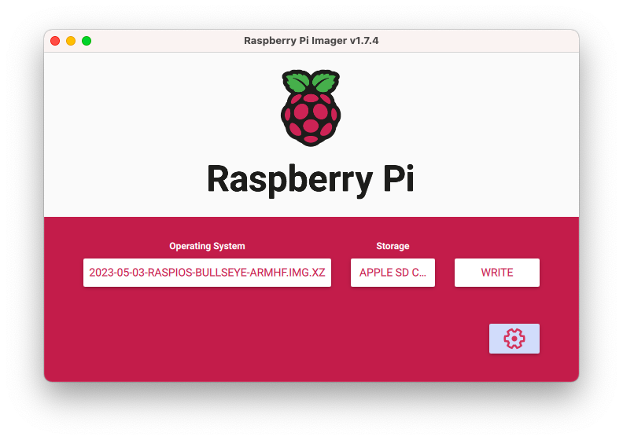

# How to Build a Low-Cost HPC Cluster

> This guide is the result of an independent study performed by [Nathan H. Silverman](https://www.linkedin.com/in/nathan-silverman-b35767173/), a  [Kalamazoo College](https://www.kzoo.edu)'s student in Computer Science, under the supervision of Sandino Vargas-Pérez. 
>
> The guide presents the list of components needed to create a low-cost Bewolf-type cluster, helpful pictures, instructions for assembling hardware, software installation, commands to execute proper configuration, and more.
>
> For questions, please contact Dr. Vargas-Pérez via [e-mail](mailto:sandino.vargasperez@kzoo.edu).

The guide was designed to build a cluster using 4 Raspberry Pi (RPi) computers, but it can be used to build a cluster of any size. The step-by-step instructions will detail how to assemble hardware, configure software, and the setup needed to have a fully functioning RPi cluster. Raspberry Pi 3 B+s were used for this project, although with a few tweaks, any modern RPi should work.

# Hardware Setup and Assembly

Below are instructions to assemble a 4 RPi cluster. One RPi will be used as a head node, and the rest will be worker nodes. The following diagram shows the layout for the cluster and its components: <br><br>

### Materials Required:
*The materials needed might change depending on their availability.*

- 4 Raspberry Pi (RPi) computers
- 4 MicroSD cards (32 or 64 GB w/adapter)
- 5 Ethernet cable (cat 5e or 6, 1 foot in length or more)
- 4 Micro USB Cords
- 1 Ethernet switch (with 5 ports or more)
- 1 USB power adapter (with 5 ports or more, 2.4 amps per port)
- 1 Stackable acrylic case for RPis
	- Make sure this item includes 4 layers, heatsinks, and it is compatible with the RPi model chosen <a href="https://www.amazon.com/dp/B07BGYGLZG/?coliid=I3A352BNN34AM2&colid=GT5EJQ2GW4AP&psc=1" target="_blank">&#10697;</a>. 
- Recommended tools:
	- Tweezers (Optional)
	- Screw driver
	- Monitor (or Ethernet to USB adapter to connect via VNC)

## Hardware Assembly

1. Installing Heat Sink: The stackable acrylic case included heat sinks. Install three heat sinks per RPi; two larger ones and a smaller one. The two larger heat sinks go on the Broadcom CPU and the RAM chip, the smaller one goes on the Ethernet and USB controller. Install heat sinks by removing the filament on the bottom and pushing firmly until they are attached securely. For all RPis: 
	1. Install a large heat sink on Broadcom CPU and a small heat sink on the Ethernet and USB controller, both located on top of the RPi:<br>
	1. Install a large heat sink on the ram chip located on the bottom of the RPi:<br>

1. Place the RPi on acrylic plate. For all RPis:
	1. Review any included instructions for the case. 
	1. Remove protective films from each side of the plate. (This can be difficult; use a screwdriver or tweezers).
	1. Place screws in the plate such that the screw heads are against the plate and the threads are pointing up, making sure that it is the correct orientation. The square cutout in the plate should line up with the heatsink on the bottom of the RPi.
	1. Put spacers on the screws on top of the plate: **screw -> plate -> spacer**.
	1. Place RPi through the screws such that the heat sink on the bottom fits through the square cutout: **screw &rarr;  plate &rarr;  spacer &rarr; Pi**. 
	1. Place and tighten nuts on the screws on top of the RPi, making sure to tighten them: **screw &rarr; plate &rarr; spacer &rarr; RPi &rarr; nut**. 

1. Stack RPis to form a tower:
	1. Put the screw end of the nub through the plate into the open end of the leg to keep it in place. Repeat for all four of the first layers: **nub &rarr; plate &rarr; leg**
	1. Place the next plate on top of the screw end of the leg: **leg &rarr; plate &rarr; leg**
	1. Place the final plate on legs then and secure it with the silver nut on top: **leg &rarr; plate w/o Pi &rarr; silver nut**

# Software Installation and Setup

The next sections will walk through setting up the microSD cards for the cluster. These examples were using macOS, but all the software needed can be downloaded for Windows OS.

### Software Download Requirements:
- Latest version of **Raspberry Pi OS with desktop** for head node and **Raspberry Pi OS Lite** for worker node <a href="https://www.amazon.com/dp/B07BGYGLZG/?coliid=I3A352BNN34AM2&colid=GT5EJQ2GW4AP&psc=1" target="_blank">&#10697;</a>.
- **Etcher** to install (flash) Raspberry Pi OS images into the microSD card <a href="https://www.balena.io/etcher/" target="_blank">&#10697;</a>.
- **VNC Viewer** to connect to the head node using an external computer (optional) <a href="https://www.realvnc.com/en/connect/download/viewer/" target="_blank">&#10697;</a>.


## Setting Up MicroSD Cards 

1. Formatting MicroSD Card:
	1. Plug microSD card into a computer. *Use a USB to microSD adapter if the computer doesn't have microSD or SD card slots*.
	1. On macOS: open **Disk Utility** and navigate to the microSD card. Select **Erase** in the top center of the window. In the "Format" dropdown menu, select "MS-DOT (FAT)". Click **Erase** (the name of the device does not matter).
	1. On Windows: use **Windows Explorer** to locate the microSD card, right-click on it, and select **Format**. Select **Quick Format** and click start.
1. Open Etcher to flash the microSD card:
	1. Click **Select image** and navigate to where the Raspberry Pi OS was downloaded. The files should end in `.img.` Select **Raspberry Pi OS with desktop** if flashing the head node's microSD card, or  **Raspberry Pi OS Lite** if flashing the worker nodes' card.
	1. Click **Select target** and chose the microSD card.
	1. Click **Flash!** <br>
1. Remove and re-insert the flashed microSD card into the computer. *Must of the time Etcher will automatically eject SD cards when finished*
1. Using a text editor such as **Sublime Text**, create an empty file named `ssh` (without an extension) and save it on the microSD card. Do this for all 4 microSD cards. Alternatively, navigate to the microSD card via terminal, and use the command `touch ssh` to create the empty file.

## Configuring RPis

Next are instructions to logging into the RPis and edit some configuration files to make them work as a cluster. Accessing the RPis can be done with or without an external monitor. Follow **1. Access RPi with external monitor** if use an external monitor, or **Access RPi without external monitor** otherwise.

1. **Access RPi with external monitor**:
	1. Insert the microSD card into the RPi. 
	1. Connect RPi to Internet using an Ethernet cable (if the RPi comes with WiFi, this is optional).
	1. Connect external monitor through HDMI.
	1. Connect the RPi to the USB power adapter using one of the micro USB cables, and then turn the RPi on. A boot up screen should show up in the external monitor.
	1. Once booted up, some versions of **Raspberry Pi OS** will have a prompt to change password, set time zone, and update the OS. Follow these instructions, or do it manually later.

    If the RPi has started but the external monitor is not getting a signal, unplug RPi and remove its microSD card. Insert the card into a computer and navigate to its contents. Locate and open the file `config.txt`. If the following lines are commented out, uncomment them by removing the `#` in front of them (if they don't exist, add them): 
    ```
    hdmi_force_hotplug=1
    hdmi_drive=2
    ```
    Re-insert the microSD in the RPi and turn it on. If the previous modifications didn't fix the problem, check that the monitor is connected properly to the correct input, and the HDMI cable is functional.

1. **Access RPi without external monitor**: This step will require an Ethernet to USB adapter to connect the RPi via Ethernet cable to a computer using **VNC viewer**. If the computer has an Ethernet port, the adapter is not needed.

<!--  Below explains how to log in to the Raspberry Pi using a process called ssh. If you are using a headless Pi, meaning it is running Raspbian Lite, skip steps 8-11. 
VNC viewer  https://www.realvnc.com/en/connect/download/viewer/macos/
1.)	Insert your microSD card into your Pi. 
2.)	Plug an Ethernet cord into the Pi and your computer. (Macs may need an adapter)
3.)	Also, plug your micro USB into your computer and Pi. 
4.)	Make sure Internet sharing is turned on. (You can do this by going to “System Preferences” -> “Sharing”. And make sure “Internet Sharing” is checked and you are sharing your WiFi connection to the LAN connection. 
5.)	Open terminal and run the command “ping raspberrypi.local”
6.)	Copy the IP address that is connected to the Pi. (press control z to stop it “^z”).
7.)	Then use the command “ssh pi@~your Pi’s IP~”. For example mine was ssh pi@192.168.2.8
8.)	Type “Yes” and hit enter
9.)	Enter the Pis username and password. (By default the username is “pi” and the password is “raspberry”) ***If working on a headless Pi proceed to section 2.3 now***
10.)	Now we will start the VNC virtual desktop by typing “vncserver”
11.)	Copy the IP of your Raspberry Pi.
 -->
